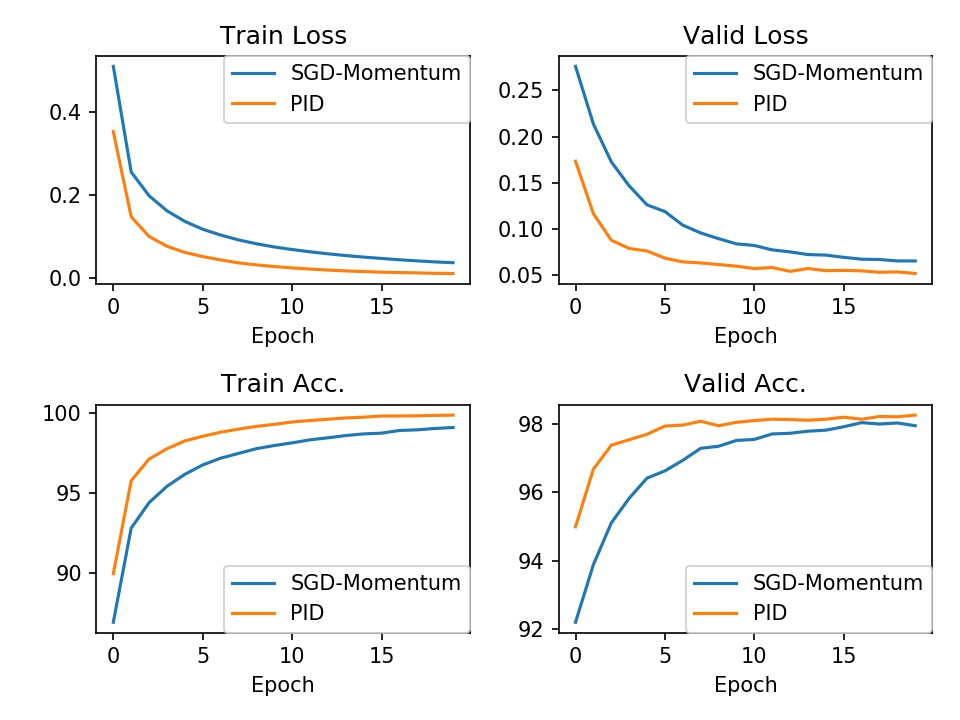

# A PID Controller Approach for Stochastic Optimization of Deep Networks, CVPR 2018.
## Requirements
Tested under python2.
- python packages
  - matplotlib==2.0.2
## Visualization:
## Train MLP on MNIST DATAST
`python mnist_pid.py`
`python mnist_momentum.py`
`python compare.py`

<div align="center">
  
  <p>PID Vs. SGD-Momentum</p>
</div>

## Citation:
If PIDOptimizer is used in your paper/experiments, please cite the following paper.
```
@inproceedings{pid2018,
   title={A PID Controller Approach for Stochastic Optimization of Deep Networks},
   author={Wangpeng An and Haoqian Wang and Qingyun Sun and Jun Xu and Qionghai Dai and Lei Zhang},
   booktitle={The IEEE Conference on Computer Vision and Pattern Recognition (CVPR)},
   month = {June},
   year={2018}
}
```
